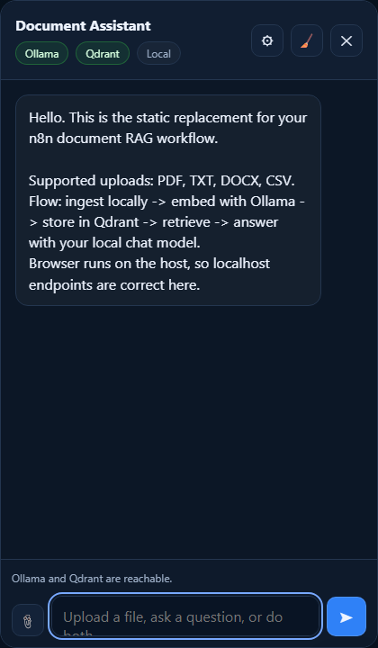
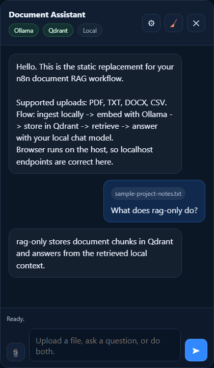
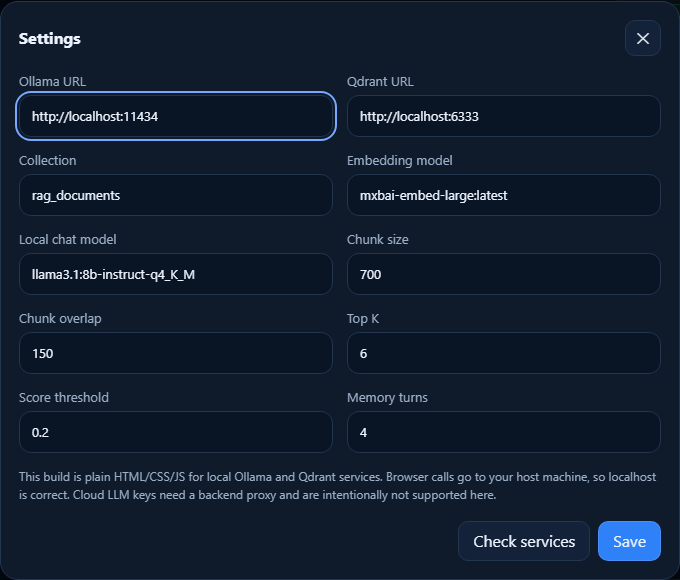
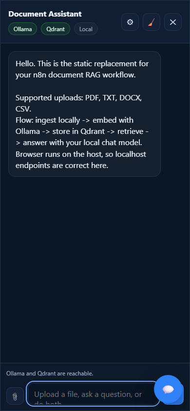
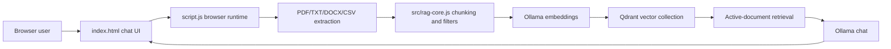

# LocalDoc RAG


**Browser-only document RAG for local Ollama + Qdrant.**

LocalDoc RAG is a static, local-first document chat app for PDF, TXT, DOCX, and CSV files. It runs as plain browser JavaScript, extracts and chunks documents in the browser, stores vectors in Qdrant, and asks a local Ollama chat model to answer from retrieved context.

The GitHub repository was renamed from `rag-only` to `local-doc-rag` for clearer discovery. The current package/app identifier remains `rag-only` in runtime metadata until a separate core-file edit is approved.

It is for developers, local AI builders, students, and technical evaluators who want to understand or demo a minimal retrieval-augmented generation workflow without a hosted backend and without putting cloud model API keys into browser settings.


_Conceptual supporting artwork. Real product screenshots are below._

## Preview

These are real captures of the current app UI. The workflow screenshot uses sanitized sample text and mocked local Ollama/Qdrant responses so the repository preview does not depend on private files, tokens, or local service data.









## What It Does

- Runs as plain HTML, CSS, and JavaScript.
- Lets the user attach PDF, TXT, DOCX, or CSV files from the chat composer.
- Extracts text in the browser, chunks it, and embeds each chunk with local Ollama.
- Stores vectors and document metadata in Qdrant.
- Scopes retrieval to the active uploaded document when possible.
- Sends retrieved context to a local Ollama chat model for grounded answers.
- Stores non-secret settings in browser `localStorage`.
- Keeps cloud model API key fields out of the browser UI by design.

## Why It Exists

Many document chat demos hide the retrieval pipeline behind a framework, hosted API, or backend service. LocalDoc RAG keeps the moving parts visible:

- Browser document parsing and chat UI.
- Ollama embeddings and local chat completion calls.
- Qdrant vector writes, dedupe checks, and active-document search.
- Small, testable helper logic in `src/rag-core.js`.

That makes the project useful as a learning repo, a local demo, or a starting point before adding a backend proxy, authentication, hosted model support, or production storage controls.

## Who It Is For

| Audience | What they can evaluate quickly |
| --- | --- |
| Beginners learning RAG | The end-to-end flow from upload to chunks, embeddings, vector search, and answer generation |
| Local AI users | A browser UI for Ollama + Qdrant document chat on a trusted machine |
| Professional engineers | Static-app boundaries, security caveats, CI coverage, and extension points |
| Maintainers | A small repo with feature docs, tests, issue templates, and contributor guidance |

## What It Does Not Do Yet

- No backend proxy, authentication, authorization, or server-side secret storage.
- No public multi-user deployment architecture.
- No OCR for scanned PDFs.
- No vendored fallback for the jsDelivr Mammoth and PDF.js browser dependencies.
- No npm package publishing; `package.json` is marked private so the project is source-first.

## Tech Stack

| Area | Technology | Source |
| --- | --- | --- |
| Runtime | Static HTML, CSS, browser JavaScript modules | `index.html`, `style.css`, `script.js` |
| Local AI | Ollama embeddings and chat endpoints | `script.js`, `src/rag-core.js` |
| Vector store | Qdrant collections and points API | `script.js` |
| Document parsing | PDF.js for PDFs, Mammoth for DOCX, `TextDecoder` for TXT/CSV | `script.js`, `index.html` |
| Tests | Node test runner and Playwright Chromium tests | `tests/`, `playwright.config.js` |
| CI | GitHub Actions, CodeQL, Dependabot | `.github/` |

## Architecture



Key boundaries:

- Browser `localStorage` stores only non-secret settings.
- Qdrant stores vectors and payload metadata for uploaded documents.
- Ollama and Qdrant must be reachable from the user's browser.
- Hosted model keys require a backend proxy and are intentionally unsupported in this static build.

More detail: [Architecture](docs/ARCHITECTURE.md), [feature map](docs/features/README.md), and [deployment notes](docs/deployment.md).

## Project Structure

```text
.
|-- index.html                 # Static app shell and SEO metadata
|-- style.css                  # Responsive browser UI
|-- script.js                  # Browser runtime and service integration
|-- src/rag-core.js            # Pure helpers with unit coverage
|-- scripts/serve-static.js    # Local static file server for development
|-- tests/                     # Unit, static asset, and Playwright tests
|-- docs/features/             # Contributor-facing feature map
|-- docs/operations/           # Productionization decisions and evidence
|-- docs/assets/screenshots/   # Maintained README screenshots
`-- .github/                   # CI, CodeQL, Dependabot, issue, and PR templates
```

The archived original implementation remains at `docs/archive/script_fixed.legacy.js` for traceability. It is not loaded by `index.html`.

## Prerequisites

- Node.js 22 or newer.
- npm 11 or compatible npm for installing the locked dependencies.
- A browser that supports modern JavaScript modules.
- Ollama reachable from the browser, default `http://localhost:11434`.
- Qdrant reachable from the browser, default `http://localhost:6333`.
- Ollama models for the default settings:
  - `mxbai-embed-large:latest`
  - `llama3.1:8b-instruct-q4_K_M`

## Quick Start

From a fresh clone:

```powershell
git clone https://github.com/RossDmello2/local-doc-rag.git
cd local-doc-rag
npm install
npx playwright install chromium
npm run serve
```

Open:

```text
http://127.0.0.1:8000/
```

Start the local services required for real RAG use:

```powershell
ollama pull mxbai-embed-large:latest
ollama pull llama3.1:8b-instruct-q4_K_M
docker run --rm -p 6333:6333 qdrant/qdrant
```

macOS/Linux shells use the same npm and Ollama commands. If Docker is unavailable, run Qdrant with any local installation method that exposes `http://localhost:6333` to the browser.

First successful run should show green Ollama and Qdrant status pills, let you upload a supported document, and return an answer based on retrieved local context.

## Configuration

The app does not read environment variables. There is intentionally no `.env.example` because all supported configuration is entered in the Settings modal and saved in browser `localStorage`.

Supported settings:

| Setting | Default |
| --- | --- |
| Ollama URL | `http://localhost:11434` |
| Qdrant URL | `http://localhost:6333` |
| Qdrant collection | `rag_documents` |
| Embedding model | `mxbai-embed-large:latest` |
| Local chat model | `llama3.1:8b-instruct-q4_K_M` |
| Chunk size | `700` |
| Chunk overlap | `150` |
| Retrieval top K | `6` |
| Score threshold | `0.2` |
| Memory turns | `4` |

More detail: [Configuration](docs/CONFIGURATION.md).

## Common Workflows

Run the local static server:

```powershell
npm run serve
```

Check syntax:

```powershell
npm run check:syntax
```

Run unit and static asset tests:

```powershell
npm test
```

Run browser workflow tests:

```powershell
npm run test:e2e
```

Run the full maintainer gate:

```powershell
npm run verify
```

## API And Data Model

This repository does not expose a backend API. The browser calls:

- Ollama `/api/tags`, `/api/embeddings`, and `/api/chat`.
- Qdrant `/collections`, `/collections/{collection}`, `/points/scroll`, `/points`, and `/points/search`.

Qdrant payloads include source name, file hash, document id, chunk index/count, chunk settings, embedding model, schema version, ingestion status, upload time, and file size.

## Testing

Required checks before claiming a change complete:

```powershell
npm run check:syntax
npm test
npm run test:e2e
npm audit --audit-level=high
```

The Playwright suite starts the static server automatically and mocks Ollama/Qdrant for the safe RAG workflow test.

## Deployment

LocalDoc RAG is deployable as static files only for controlled environments where the user's browser can safely reach trusted Ollama and Qdrant services. Public internet deployment as a shared RAG product requires a backend proxy, authentication, provider-key isolation, request validation, rate limiting, and Qdrant access control.

See [Deployment](docs/deployment.md).

## Troubleshooting

Common first checks:

- Open the app through `http://127.0.0.1:8000/`, not `file://`.
- Confirm Ollama and Qdrant are running and reachable from the browser.
- Check browser CORS/network errors when service status pills are red.
- Use a text-based PDF for PDF parsing; scanned PDFs need OCR, which this app does not include.

More detail: [Troubleshooting](docs/TROUBLESHOOTING.md).

## Security

- Do not paste cloud provider API keys into this app.
- Do not expose local Ollama or Qdrant broadly on a public network.
- Uploaded files are parsed in the browser and capped at 25 MB.
- Qdrant writes happen from the browser to the configured collection.
- Public multi-user hosting needs a different architecture.

See [Security Policy](SECURITY.md).

## Contributing

Read [CONTRIBUTING.md](CONTRIBUTING.md), [AGENTS.md](AGENTS.md), and the matching [feature document](docs/features/README.md) before opening a feature PR. Keep changes scoped, tested, and aligned with the static-app boundary.

## Discoverability

Current GitHub topics should stay aligned with the inspected source:

```text
rag, retrieval-augmented-generation, document-chat, ollama, qdrant,
local-first, browser, static-site, vector-search, pdf-chat,
javascript, document-search, document-qa, semantic-search, local-llm
```

See [SEO and discoverability](docs/seo-discoverability.md) and the [naming and SEO strategy](docs/NAMING_SEO_STRATEGY.md).

## Current Status

**READY WITH GAPS** for public source publication.

Verified locally on June 1, 2026:

- `npm install`
- `npm run check:syntax`
- `npm test`
- `npm run test:e2e`
- `npm audit --audit-level=high`
- Playwright screenshot capture for desktop, workflow, settings, and mobile UI

Known gaps:

- Real Ollama and Qdrant services were not live-tested in this publication pass; browser workflow tests use safe mocked responses.
- No public hosted demo is configured.
- Public multi-user deployment requires a backend-proxy product change.
- GitHub private vulnerability reporting and Discussions must be configured in repository settings if the maintainer wants those channels.

## License

MIT. See [LICENSE](LICENSE).
