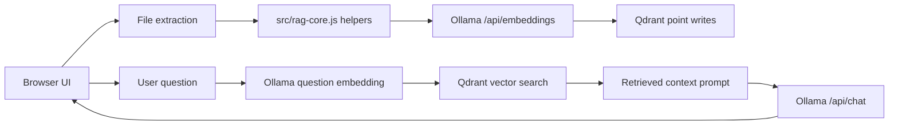

# Architecture

LocalDoc RAG is a static browser-only RAG app. Node is used for local serving and tests, not for the product runtime.

## Component Flow

## Runtime Files

| File | Responsibility |
| --- | --- |
| `index.html` | App shell, settings modal, file input, chat panel, browser metadata |
| `style.css` | Responsive assistant panel, modal, mobile layout, focus states |
| `script.js` | Browser orchestration, file extraction, service calls, chat rendering |
| `src/rag-core.js` | Defaults, validation, chunking, Qdrant filter helpers, error formatting |
| `scripts/serve-static.js` | Local development static server |

## Data Boundaries

- Browser memory holds the current pending file, active document id, and active conversation.
- Browser `localStorage` stores non-secret settings only.
- Qdrant stores vectors and payload metadata for uploaded file chunks.
- Ollama provides embeddings and chat completion responses.
- There is no backend API, database migration system, auth layer, queue, scheduler, payment path, or email send path.

## External Dependencies

The browser loads Mammoth from jsDelivr through `index.html` and PDF.js from jsDelivr through `script.js`. If those CDN requests fail, DOCX or PDF parsing can fail. TXT and CSV parsing use browser-native text decoding.

## Security Boundary

This app should be treated as a trusted local workflow. Public multi-user deployment needs a backend proxy, authentication, server-side secrets, request validation, rate limiting, and Qdrant access controls.

For feature-level ownership, see [docs/features/README.md](features/README.md).
